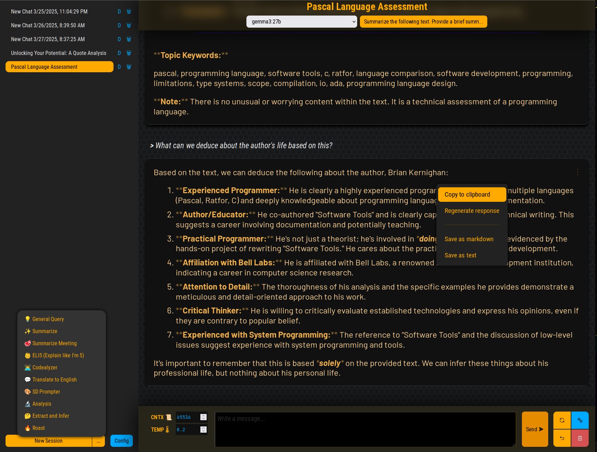

# Chit - Web-based Chat Interface for Ollama



## Overview

Chit is yet another chat interface for interacting with local large language models through Ollama.

It's primary focus is providing a useful browser-only interface that does not rely on a third-party server, besides Ollama itself. It only saves data to the browser via the browser's'regular applicaton storage.

Later I may add an optional thin server component for performing tasks the browser can't.

This personal project is a constant WIP, and I'm not (yet) accepting PRs for new features or fixes.

## Features

- 🤖 Connect to local Ollama instance for AI chat functionality
- 💬 Multiple chat sessions with persistent storage
- 🔧 Customizable system prompts and model parameters
- 🔊 Audio feedback for typing and responses
- 📚 Preset system prompts for various use cases (analysis, code review, ELI5, etc.)

## Prerequisites

- [Ollama](https://ollama.ai/) running locally or on an accessible server
- A compatible AI model loaded in Ollama (e.g., Llama 3.1, etc.)

## Building and Developing

1. Clone the repository:
   ```bash
   git clone https://github.com/yourusername/chit-svelte5.git
   cd chit-svelte5
   ```

2. Install dependencies:
   ```bash
   npm install
   ```

3. Start the development server:
   ```bash
   npm run dev
   ```

4. Open your browser and navigate to http://localhost:4000


### Building for Production

To build the application for production:

```bash
npm run build
```

This will create a production build in the `docs` folder.

To preview the production build locally:

```bash
npm run preview
```

## Development

Chit is built with:

- [Svelte 5](https://svelte.dev/)
- [Vite](https://vitejs.dev/)
- [Ollama JS SDK](https://github.com/ollama/ollama-js)

The project structure follows Svelte conventions:

- `/src` - Source code
  - `/app` - Main application components
  - `/lib` - Utility functions, stores, core logic
  - `/preset-prompts` - Predefined system prompts


----
2025, Network47.org
