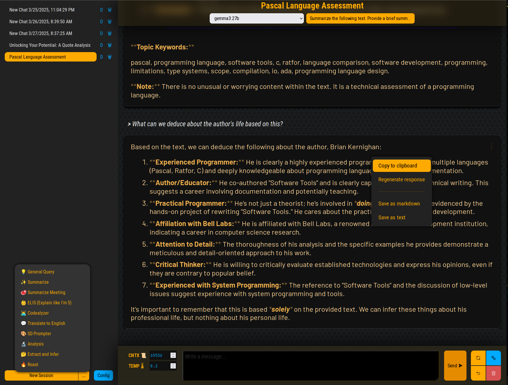

# Chit - Browser-Based Chat Interface



## Overview

Chit is a browser-only chat interface for interacting with large language models through any OpenAI-compatible API. It requires no server — all data is stored in the browser via IndexedDB and regular application storage.

This personal project is a constant WIP, and I'm not (yet) accepting PRs for new features or fixes.

## Features

- 🤖 **OpenAI-Compatible API** — Connect to any OpenAI-compatible backend (Ollama, LM Studio, vLLM, etc.) with configurable base URL and API key
- 💬 **Multiple Chat Sessions** — Create, switch between, and manage multiple persistent chat conversations
- 💾 **Persistent Storage** — Chat history, settings, and media are saved to IndexedDB and survive browser reloads
- 🎨 **Customizable System Prompts** — Set per-chat system prompts with user and system variable templating
- 📚 **Preset System Prompts** — Built-in prompt templates for common use cases (analysis, code review, ELI5, etc.)
- 🎛️ **Advanced Model Parameters** — Fine-tune temperature, top_p, presence penalty, repeat penalty, top_k, and seed per chat
- 💭 **Thinking Mode** — Models that support reasoning output display collapsible thinking blocks separate from the final response
- 🖼️ **Image Upload and Paste** — Attach images via file picker or clipboard paste; images are resized and stored in IndexedDB
- 🎵 **Audio Upload** — Attach .wav and .mp3 audio files for multimodal inference, displayed as playable cards in the timeline
- 📄 **Text File Attachments** — Attach code and text files (.py, .js, .json, .txt, .md, .csv, .xml, .yaml, etc.) that are inline with messages
- 🔧 **Tool System** — Built-in tools (calculator, time, ask-questions, echo, say) with support for MCP (Model Context Protocol) server integration
- 🔊 **Text-to-Speech** — Read responses aloud with configurable TTS engines, auto-speak options, and quote detection for selective reading
- 🎧 **Audio Feedback** — Distinct sound cues for typing, response completion, and questions
- 📦 **Backpack References** — Attach external context references (URLs, tool outputs) to enrich the conversation context window
- ⏪ **Chat Rewind** — Rewind to any previous message to branch the conversation from that point
- 📋 **Chat Duplicate and Chop** — Duplicate messages to create branches, or chop the latest message to re-roll responses
- 📐 **KaTeX Math Rendering** — Inline and block math formulas rendered with KaTeX
- ✏️ **Markdown Editor** — Rich markdown preview with SVG copy, bbox annotation, and code block copy buttons
- 🎭 **App Modes** — Switch between standard chat mode and roleplay mode for different interaction styles

## Prerequisites

- Any OpenAI-compatible API server (Ollama, LM Studio, vLLM, etc.)
- A compatible AI model loaded in your backend

## Building and Developing

1. Clone the repository:
   ```bash
   git clone https://github.com/network47/chit.git
   cd chit
   ```

2. Install dependencies:
   ```bash
   npm install
   ```

3. Start the development server:
   ```bash
   npm run dev
   ```

4. Open your browser and navigate to `http://localhost:5173`

### Building for Production

To build the application for production:

```bash
npm run build
```

This creates a production build in the `docs` folder.

To preview the production build locally:

```bash
npm run preview
```

## Development

Chit is built with:

- [Svelte 5](https://svelte.dev/) — runtime and compiler
- [Vite](https://vitejs.dev/) — build tool and dev server
- [SCSS](https://sass-lang.com/) — styling with nested syntax and variables
- [Markdown It](https://github.com/markdown-it/markdown-it) — markdown rendering
- [KaTeX](https://katex.org/) — math formula rendering
- [MCP SDK](https://github.com/modelcontextprotocol/typescript-sdk) — Model Context Protocol integration
- [Zod](https://zod.dev/) — runtime type validation and schema definition

The project structure follows Svelte conventions:

- `/src` — Source code
  - `/app` — Main application components
    - `/Chat` — Chat timeline, input bar, and message rendering
    - `/ChatSidebar` — Sidebar with session list, config panels, and mode controls
    - `/UI` — Shared UI primitives (modals, dialogs, buttons, pills, context menus)
    - `/components` — Reusable standalone components (async media, markdown editor)
  - `/lib` — Core logic and utilities
    - `/chatSession` — Chat state management, storage, attachments, and streaming
    - `/llm` — LLM driver interface, OpenAI-compatible driver, and response detectors
    - `/tools` — Built-in tool definitions and index
    - `/mcp` — MCP (Model Context Protocol) manager and server connections
    - `/voice` — TTS engine interface, OpenAI and Web Speech implementations
    - `/backpack` — External context reference management
    - `/inputCommands` — Slash command parser and handlers
    - `/modes` — App mode logic (chat, roleplay)
    - `/text` — Text normalization and token estimation
    - `/templating` — System and user variable templating
  - `/preset-prompts` — Predefined system prompt presets
  - `/vendor` — Vendored third-party scripts (EXIF.js, FileSaver, highlight.js)
- `/public` — Static assets (favicon, manifest, syntax highlighting CSS)

----
2025, Network47.org
